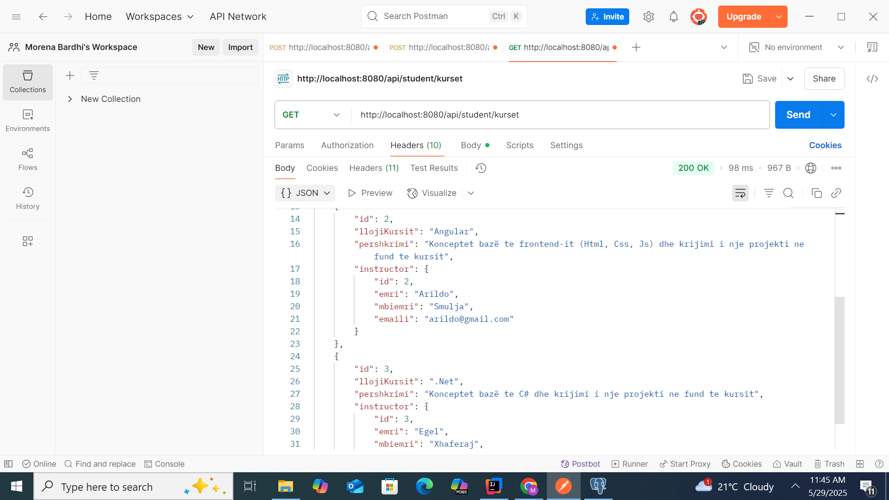
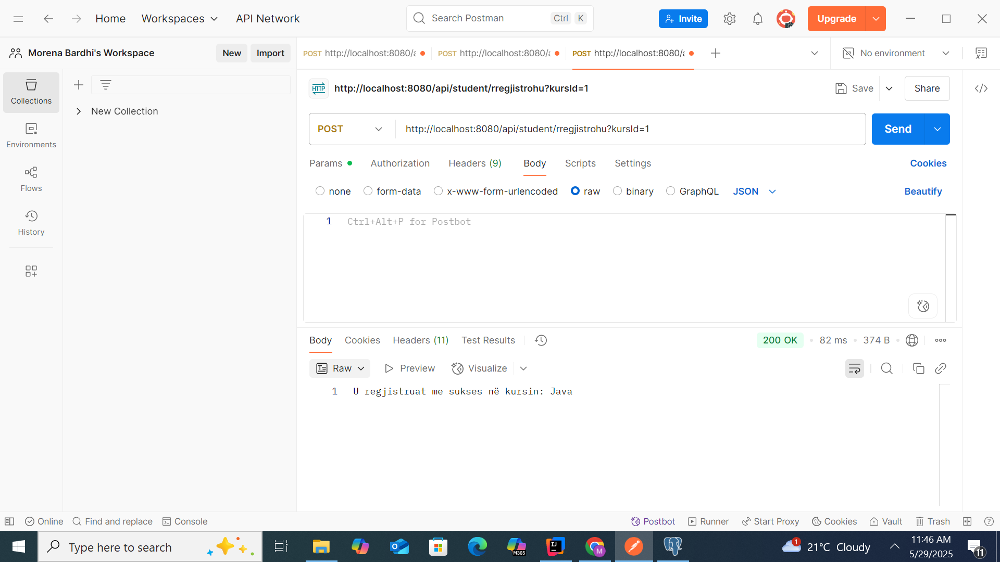
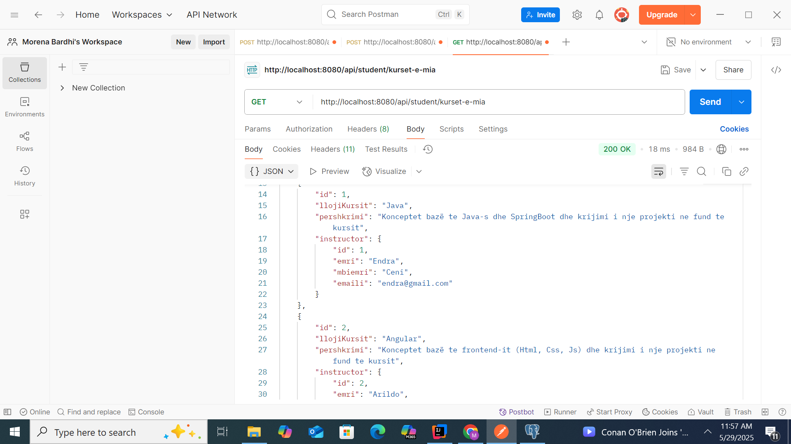
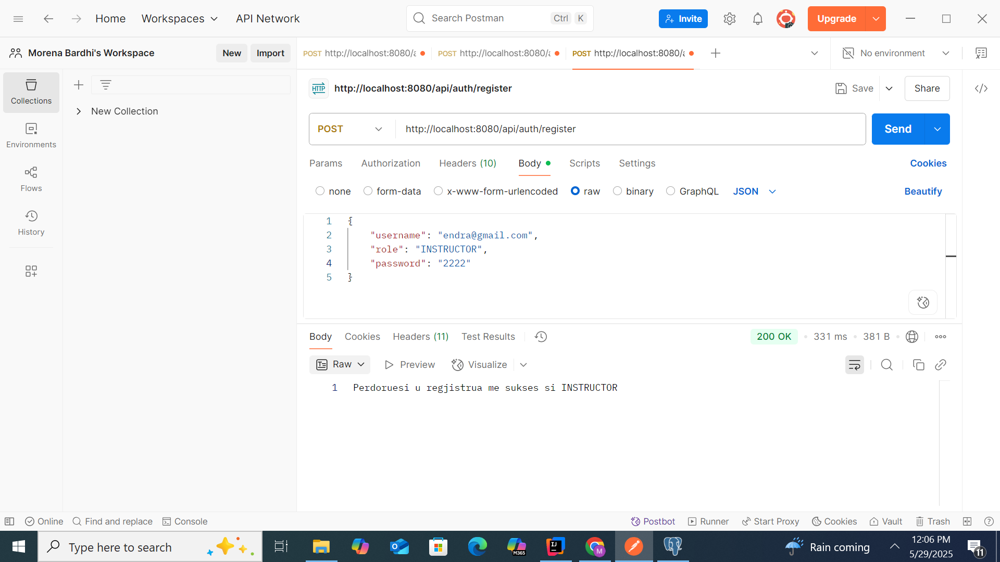
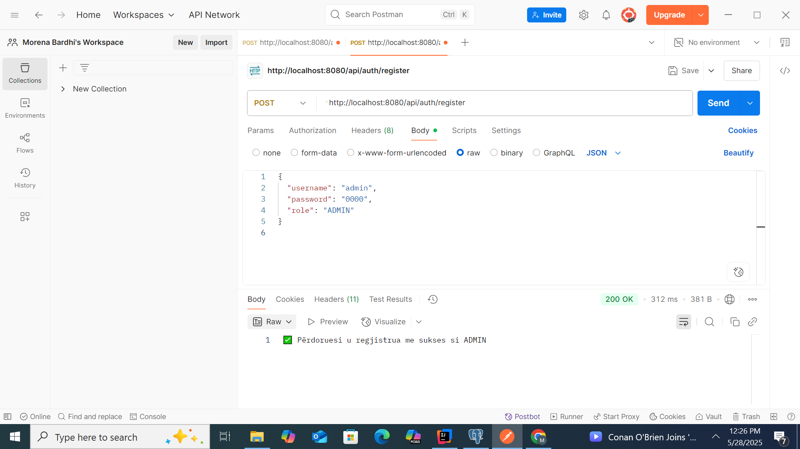
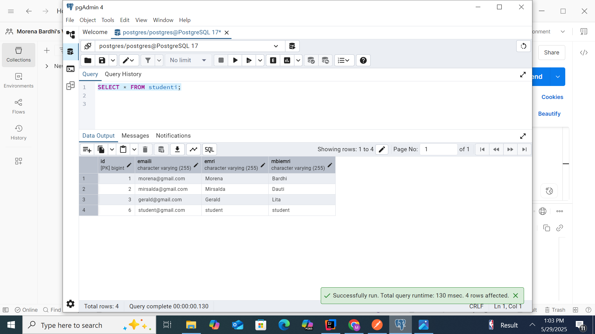

Pershkrim i Projektit (Sistem Menaxhimi Kursesh Online):

Ky projekt eshte nje aplikacion REST API i ndertuar me Java dhe Spring Boot, qe simulon nje platforme per menaxhimin e kurseve online, duke mbuluar funksionalitetet kryesore per:
-Administratorin
-Instruktorin
-Studentin

Autentikimi dhe Roli i Përdoruesit

Sistemi perkrah login/register me JWT token dhe ka 3 role:

-STUDENT: Mund te shohe kurset qe ofrohen dhe te regjistrohet

-INSTRUCTOR: Mund te krijoje, modifikoje dhe shohe kurset e veta

-ADMIN: Mund te shohe, editoje dhe fshije çdo student, instruktor apo kurs

Entitetet kryesore

Kursi

-llojiKursit: psh. Java, Angular, .Net etj

-pershkrimi: pershkrim i shkurter rreth kursit

-instructor: lidhje me instruktorin qe e drejton

Studenti

-emri, mbiemri, emaili

-Mund te regjistrohet ne disa kurse

Instructor

-emri, mbiemri, emaili

-Mund te kete disa kurse

Rregjistrimi

-lidhje many-to-many mes studenteve dhe kurseve

-dataRregjistrimit

-status: AKTIV, PERFUNDUAR, ANULUAR

 
Endpoint-e kryesore

Endpoint                  	               Roli	           Pershkrimi
POST /api/auth/register	                  publik	         Regjistrim përdoruesi
POST /api/auth/login	                     publik	         Login dhe kthim i token-it JWT
GET /api/student/kurset     	             STUDENT	        Shfaq te gjitha kurset
POST /api/student/rregjistrohu	           STUDENT	        Regjistrim ne nje kurs
GET /api/student/kurset-e-mia	            STUDENT	        Kurset ku eshte regjistruar studenti
POST /api/instructor/shto-kurs 	          INSTRUCTOR	     Shton nje kurs të ri
GET /api/instructor/kurset	               INSTRUCTOR	     Shfaq kurset e tij
PUT /api/instructor/kurset/[id]	          INSTRUCTOR	     Perditeson kursin e vet
GET /api/admin/kurset	                    ADMIN	          Shfaq te gjitha kurset
DELETE /api/admin/student/[id]	           ADMIN	          Fshin nje student
PUT  /api/admin/kursi/{id}	               ADMIN	          Editon nje kurs 
DELETE /api/admin/instructor/[id]         ADMIN	          Fshin nje instruktor

--Rregjistrimi ne sistem si student:

--Login permen Token:

--Printimi i te gjitha kurseve available:

--Rregjistrimi ne nje kurs: 

--Printimi i kurseve qe po ndjek (studenti):

--Rregjistrimi ne sistem si instruktor:

--Logimi permes token:

--Shto nje kurs (si instruktor)

--Rregjistrimi ne sistem si admin:

--logimi si admin:

--Printimi i kurseve (si admin):

--Modifikimi i nje kursi nga admini:

--Fshirja e nje studenti nga admini (nga id):

--Printimi i listes se studenteve te rregjistruar( nga admini):

--Printimi i listes se instruktoreve( nga admini):

